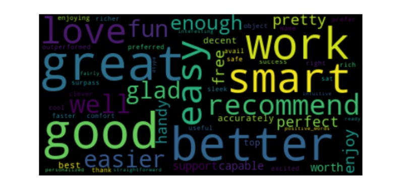
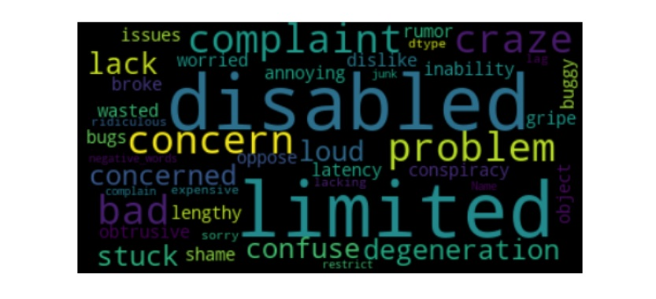
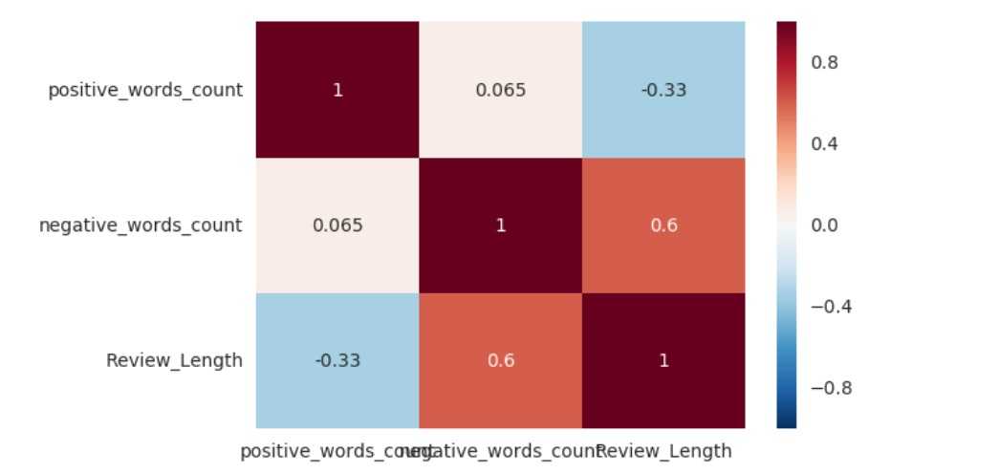

# Sentiment-Analysis-using-Naive-Bayes-Classifier-of-BEST-BUY-Google-Mini-Reviews

Sentiment analysis also known as opinion mining is the process of determining the emotional tone behind a series of words, used to gain an understanding of the the attitudes, opinions and emotions expressed within an online mention.

Performed Text Analytics determining the sentiment of reviews using Naive Bayes Classifier for Google Mini Reviews from BestBuy
 

 
 
 

## Scraped the data from Best Buy reviews of Google Mini using Python Library Beautiful Soup
 Using Beautiful Soup, web scraped around 5000 customer reviews of Google Mini  
 Based on the HTML tags, scraped the customer reviews with their name, rating, title and description
 
## Extracted the data into a dataframe using Pandas
 Customer reviews downloaded were collected in a dataframe using Pandas
 Data frame with columns as 'Review_Author','Review_Rating','Review_Title' and 'Review_Description' is created

## Bing Lexicon- lexicon containing a set of positive and negative words was extracted from a text file
 Bing Lexicon contains set of positive and negative words used for sentiment analysis
 Positive and negative words are stored in two dictionaries

## Tokenized the reviews into words using NLTK
 'nltk' library is used for lowercasing the alphabets, tokenizing the sentences and removing english stopwords
  Positive and negative words in a review are counted when compared with the Bing Lexicon, to conclude whether a review is positive, negative or neutral
  Positive Wordcloud
  
  
  Negative Wordcloud
  
 
## Categorized the reviews into positive and negative sentiment comapring it with the Bing Lexicon
   Summary sentiment is assigned to the reviews based on the count of positive and negative words in the review.
   More positive words meaning positive sentiment and likewise for the negative sentiment
   Correlation of review ratings to the sentiments of the reviews is plotted
   
 
## Applied Naive Bayes Classifier for sentiment analysis on the extracted features
   Applying the Naive Bayes Classifier calculate the probabilities for negative and positive words.Then it selects the outcome with highest probability.

For the test data , it classifies 135 negative words from a bag of 231 words and 3843 negative words from a bag of 3983 words
